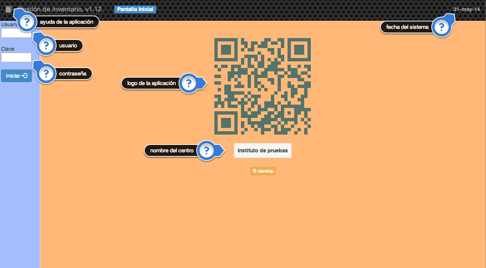
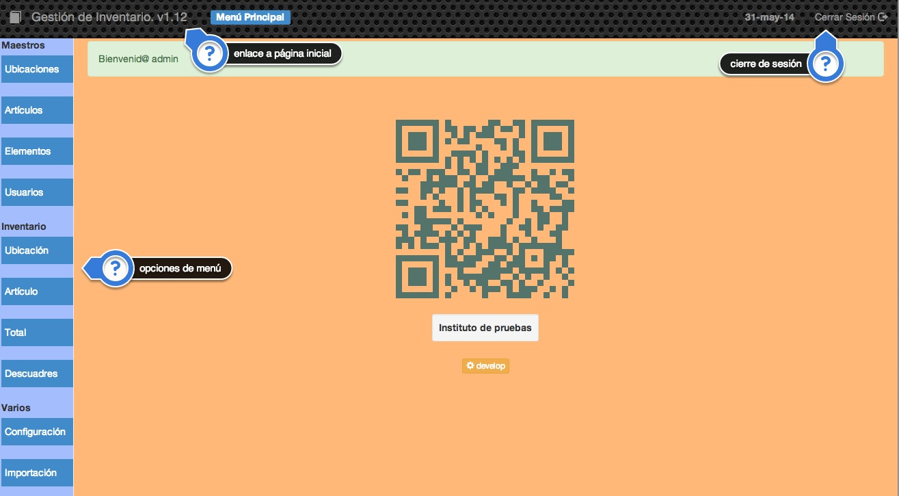

#2. Funcionamiento
En este capítulo se verá el funcionamiento básico de la aplicación. Los diferentes detalles funcionales de cada opción de la aplicación y las recomendaciones de utilización.

Cuando nos conectamos a la aplicación debemos proporcionar un usuario y una contraseña para acceder.

En esta pantalla podemos observar los enlaces siguientes:

- En la parte superior tenemos la barra de estado, tenemos ahí el icono de un libro que enlaza con la ayuda de la aplicación, el nombre y la versión de la aplicación, en un recuadro azul el nombre de la opción actual y en la parte derecha la fecha del sistema. Si pulsamos sobre ella tendremos un calendario (para cerral el calendario hay que pulsar sobre cualquier día del mismo).

- En la parte izquierda y en otro color tenemos la parte donde tendremos que facilitar el usuario y la contraseña para identificarnos en la aplicación.

- La parte central de la pantalla es donde vemos el logo de la aplicación y el nombre del centro con el que estamos trabajando. Si pulsamos sobre cualquiera de ellos obtendremos los créditos de la aplicación.

Una vez introducido un usuario y contraseña correcta nos aparecerá la pantalla principal de la aplicación.

En la parte izquierda tenemos el menú de opciones de la aplicación y en la parte superior derecha tenemos el acceso para cerrar sesión.
