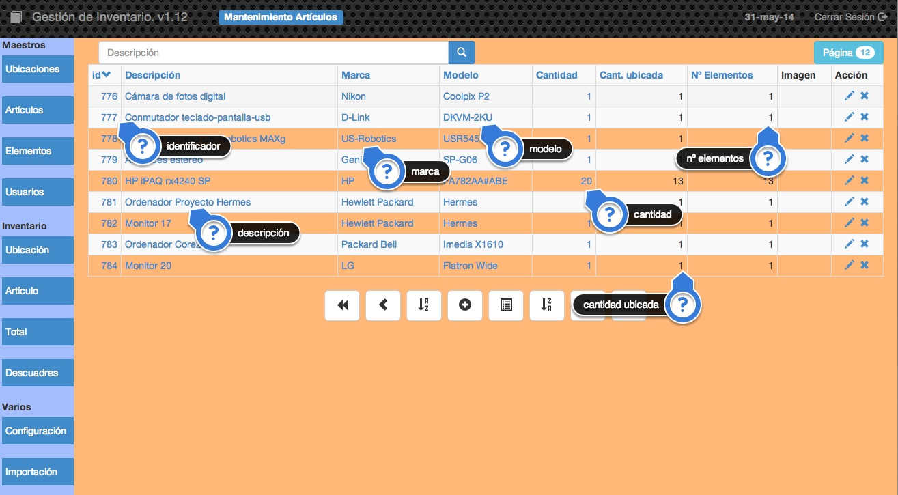

##2.1.2 Artículos
En esta tabla almacenaremos los diferentes artículos que componen nuestro inventario y algunos detalles como la marca el modelo o la cantidad.

Por ejemplo:

| Descripción | Marca | Modelo | Cantidad |
| -- | -- | -- | --:|
| Armario con puertas y cajones | Alfarero | Ciclón | 16 |
| Pupitre | Volcán | Verde | 360 |
|Ordenador | IBM| PS/2 80|5|

En este ejemplo el centro ha comprado 16 armarios del modelo Ciclón, 360 pupitres de la marca Volcán y de modelo o color verde, también tienen 5 ordenadores IBM PS2 80.

Podremos almacenar si queremos una imagen del artículo.

En la pantalla podemos observar los siguientes datos:
* __identificador:__ Es el código único asignado de forma automática por la aplicación a cada registro que añadamos a la tabla. Como se puede ver, podemos establecer el orden de visualización con este campo pulsando sobre <code>id</code> en la cabecera de la tabla. Si pulsamos sobre el indicador de un artículo obtendremos el listado de los elementos asociados a ese artículo, es decir, obtendremos el inventario de ese artículo y sabremos en qué ubicaciones se encuentra.
* __Descripción:__ Es la descripción del artíuclo. Para establecer el orden de visualización por este campo tendremos que pulsar sobre <code>Descripción</code> en la cabecera de la tabla. Si pulsamos doble click sobre la descripción de un artículo cualquiera podremos editarla sin tener que entrar en la pantalla de edición.
* __Marca:__ Marca del artículo. Al igual que en la descripción si pulsamos doble click sobre ella podremos editarla sin tener que entrar en la pantalla de edición. También podremos establecer el orden de visualización por este campo.
* __Modelo:__ Modelo del artículo, se comporta igual que el campo <code>Marca</code>.
* __Cantidad:__ Cantidad que tenemos en nuestro centro de ese artículo. Es editable con doble click y también se puede establecer el orden de visualización por este campo.
* __Cantidad ubicada:__ Es un campo calculado por la aplicación y nos muestra el número de artículos que han sido ubicados. Lo ideal es que este número coincida con el campo <code>Cantidad</code>, eso significaría que hemos dicho en qué ubicaciones se encuentran los mismos artículos que tenemos en nuestro centro. En caso contrario se produce un descuadre ya que en la aplicación tendremos informado que hemos comprado _x_ artículos pero hemos ubicado solamente _y_ artículos. Podemos obtener un informe de artículos descuadrados en la opción de <code>Inventario</code>.
* __Nº de elementos:__ Este es un campo que calcula la aplicación y nos muestra el número de registros de la tabla elementos que están asociados a este artículo. Un número 0 indicaría que todavía no hay ningún elemento asociado a esta artículo.
* __Imagen:__ Si el artículo tiene asociada una imagen aparecerá el icono imagen y al pulsar sobre este icono se nos mostrará la imagen.

