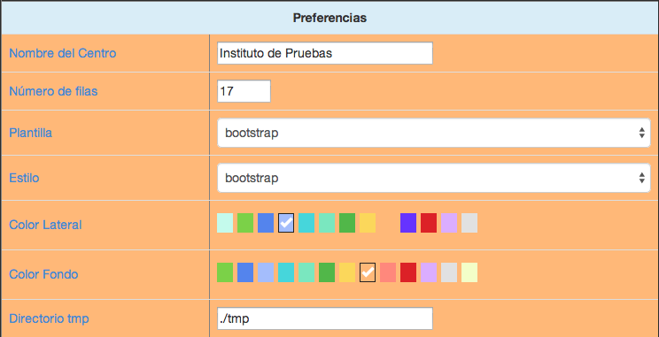
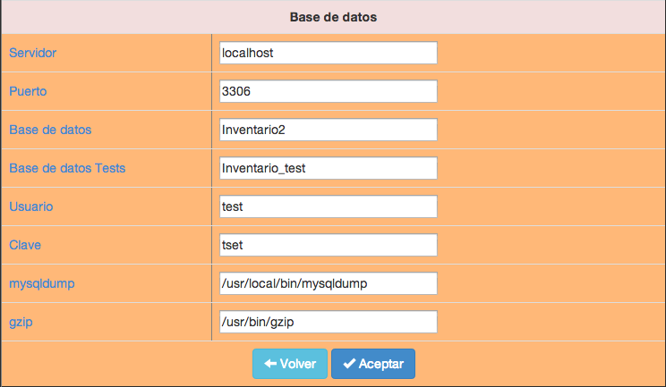

##2.3.1 Configuración
Aquí podremos personalizar la aplicación y cambiar algunos parámetros básicos para su funcionamiento.

La pantalla de entrada de datos se ha dividido en dos partes bien diferenciadas: __Preferencias__ y __Base de datos__. En la primera podremos cambiar los datos a nuestro gusto, pero la segunda es muy delicada y si no ponemos los datos correctos podremos inutilizar la aplicación, por lo que hay que ser muy cuidadoso con los datos que ahí figuran.

Si pasamos el ratón por encima de cualquiera de los nombres en la primera columna de la tabla nos dará una pequeña información de para qué se utiliza cada dato.

#### Preferencias

* __Nombre del centro.__ Nombre que aparecerá en los encabezados de todos los informes que permita la aplicación y también en la pantalla inicial de la aplicación debajo del logo.
* __Número de filas.__ Número de registros que aparecerán en las diferentes pantallas de las opciones de Maestros: Ubicaciones, Artículos, Elementos y Usuarios.
* __Plantilla.__ Plantilla de formato con el que se mostrarán todas las pantallas de la aplicación. Se aconseja utilizar _bootstrap_.
* __Estilo.__ Es el estilo de los botones de aplicación que aparecen en los Maestros. Únicamente cambia el aspecto de los mismos.
* __Color lateral.__ Podemos elegir el color de fondo de la zona donde aparecen las opciones del menú. Podemos comprobar el color tan sólo con elegirlo. No estará activo hasta que se guarden las opciones.
* __Color Fondo.__ Podemos elegir el color de fondo de la zona principal de la aplicación. Al igual que la anterior opción podremos comprobar cualquier color con tan sólo elegirlo. No se activiará hasta que se guarden las opciones.
* __Directorio tmp.__ Es el directorio _temporal_ donde se guardarán los archivos que genera la aplicación cuando se solicitan informes, archivos CSV, etiquetas, etc.

###Base de datos
    Atención: Estos datos son muy sensibles y cualquier cambio erróneo puede inutilizar la aplicación.

* __Servidor.__ Nombre o dirección IP del servidor donde se ejecuta MySQL.
* __Puerto.__ Nº de puerto donde escucha el servidor MySQL para establecer las conexiones.
* __Base de datos.__ Nombre de la base de datos donde se almacena la información de la aplicación. Esta base de datos debe estar creada en el momento de la instalación.
* __Base de datos Tests.__ Nombre de la base de datos para pruebas de la aplicación.
* __Usuario.__ Usuario de MySQL que tiene derechos de lectura y escritura sobre la base de datos especificada en los campos anteriores.
* __Clave.__ Contraseña para identificar al usuario del campo anterior en el servidor MySQL.
* __mysqldump.__ Ruta completa para la utilidad <code>mysqldump</code>. Es imprescindible para poder realizar las copias de seguridad. Si no se tiene claro qué datos poner aquí se puede consultar el _apéndice_ de este manual. Los datos normales para un servidor Linux podría ser <code>/usr/local/bin/mysqldump</code>
* __gzip.__ Ruta completa para la utilidad <code>gzip</code>. Es imprescindible para poder realizar las copias de seguridad. Si no se tiene claro qué datos poner aquí se puede consultar el _apéndice_ de este manual. Los datos normales para un servidor Linux podría ser <code>/usr/bin/gzip</code>

