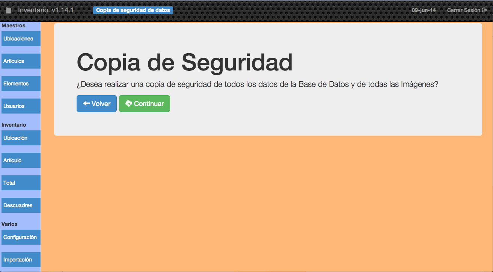
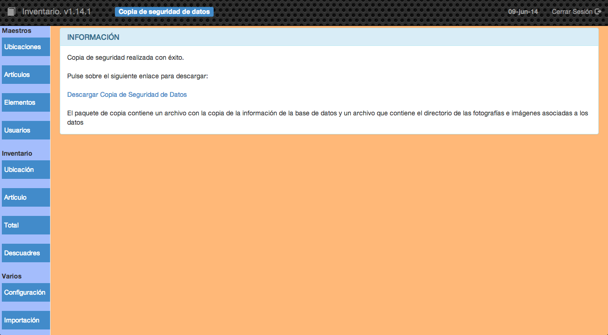

##2.3.3 Copia Datos

La copia de seguriad de la información que maneja cualquier aplicación es algo fundamental y mediante esta opción podremos obtener una copia de toda la información del inventario, tanto la almacenada en la base de datos como las imágenes asociadas.

En la primera pantalla únicamente podremos dar al botón de _continuar_ para realizar la copia de seguridad o _volver_ para ir a la pantalla principal de la aplicación.

En esta pantalla podemos ver la copia de seguridad ya realizar y tenemos que pulsar sobre el enlace __Descargar Copia de Seguridad de Datos__ para descargar en nuestro ordenador la copia realizada.

El archivo de copia de seguridad es un archivo que hace de contenedor de otros dos archivos comprimidos:

* __Imagenes.tbz__ Contiene un directorio en el que están almacenadas las imágenes que utiliza la aplicacion de inventario.
* __baseDatosInventario2.sql.gz__ Contiene un volcado de la base de datos que se puede utilizar con cualquier utilidad (mysqldump, workbench, etc.) para restaurar la base de datos.
