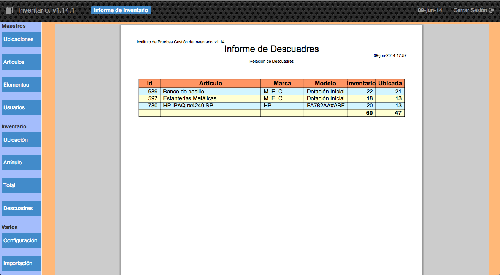

##2.2.4 Descuadres

Esta opción es muy útil para comprobar si hemos asignado correctamente la cantidad de artículos que tenemos, es decir, si tenemos asignados mediante elementos todos los artículos que hemos comprado, en las ubicaciones del centro.

En este ejemplo se puede observar que tenemos 22 bancos de pasillo pero únicamente hemos ubicados 21 por lo que habría que, o bien crear un elemento con cantidad 1 del artículo banco de pasillo en una ubicación, o bien modificar la cantidad de uno de los elementos existentes de este artículo.

