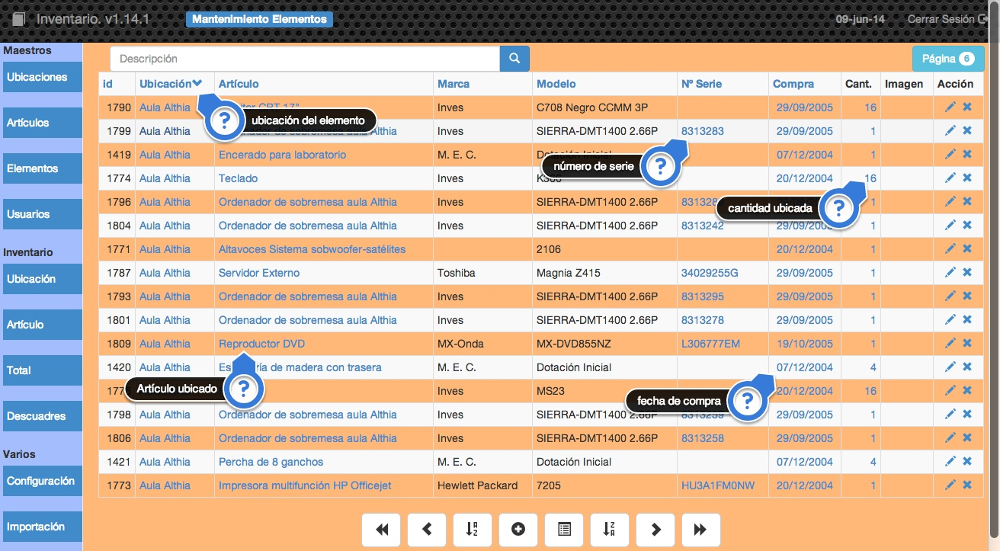

##2.1.3 Elementos
Esta es la tabla en la que se especifica donde se ubican cada uno de los artíulos que posee el centro.

Por ejemplo:

| Artículo | Ubicación | Cantidad | Nº Serie| ... |
| -- | -- | --: | -- | :--: |
| Ordenador IBM PS/2 80 | Aula de Ciencias | 1 | FXR-35916 | ... |
| Pupitre Volcán Verde | Aula de Ciencias | 30 |  | ... |
| Armario con puertas y cajones | Aula de Ciencias | 2 | | ... |
| Ordenador IBM PS/2 80 | Aula de Idiomas | 1 | YJM-42937 | ... |

De esta forma se distribuyen en las diferentes ubicaciones todos los elementos que tenemos en el centro, por lo que un **elemento** podríamos definirlo como la concreción de un determinado artículo en una ubicación. En el ejemplo anterior ubicar el Ordenador IBM PS/80 en el Aula de Ciencias cuyo número de seríe es FXR-35916 constituye un elemento. También lo es la ubicación de 30 pupitres en ese mismo aula.

Cuando creamos un elemento podremos utilizar los campos:

    "Nº de serie"  "Fecha de Compra"

Habrá elementos en los que sea necesario o queramos introducir el número de serie como por ejemplo en aparatos electrónicos, y en general en aquellos en los que queramos que este dato figure en el inventario. También existirán artículos como los pupitres, armarios, pizarras, bancos, tablones, etc. en los que no sea necesario introducir el número de serie.

La introducción del número de serie supone que para cada unidad de artículo tendremos que crear un elemento para poder registrar la información de número de serie.

Podremos almacenar si queremos la imagen del elemento.

Los datos que podemos editar y almacenar como un elemento son:

* __Ubicación.__ La ubicación donde se halla el artículo.
* __Artículo.__ El artículo que estamos ubicando.
* __Número de serie.__ Es un campo opcional que podemos rellenar en caso de que lo necesitemos. Por ejemplo este campo lo rellenaremos cuando creemos elementos de aparatos electrónicos y no será necesario en otro tipo de artículos como por ejemplo pupitres. Tiene sentido únicamente cuando la cantidad a ubicar sea 1.
* __Fecha de compra.__ La fecha de compra del artículo o artículos que estamos ubicando.
* __Cantidad.__ La cantidad de artículos que ubicamos.
