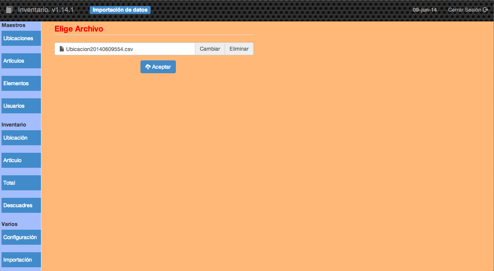
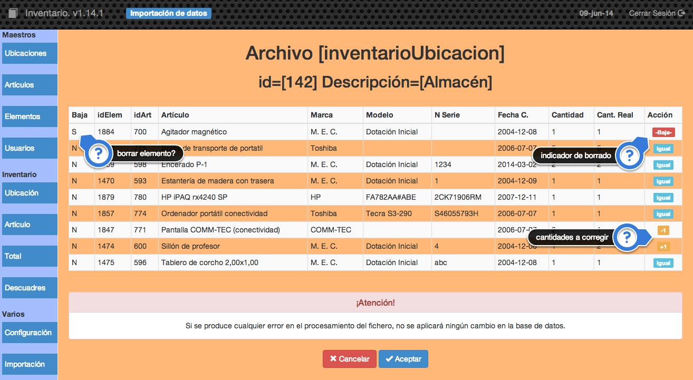
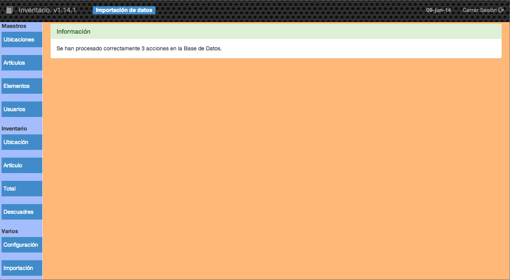

##2.3.2 Importación

Esta opción puede ser interesante si queremos actualizar el inventario mediante la utilización de una hoja de cálculo.

En primer lugar habrá que generar un archivo _csv_ mediante cualquiera de las dos opciones de Inventario que son capaces de hacerlo, es decir, las opciones de <code>Ubicación</code> y <code>Artículo</code>.

Una vez generado tendremos que utilizar cualquiera de los programas de hoja de cálculo para actualizar este archivo, podremos por tanto utilizar: [Libreoffice](http://www.libreoffice.org/), [Microsoft Excel](http://es.wikipedia.org/wiki/Microsoft_Excel), [Google Drive](http://www.google.com/intl/es/drive/), etc.

Una vez que tengamos el archivo _csv_ con la información actualizada (es importante no cambiar el formato al archivo cuando se guarde) tendremos que utilizar esta opción para subirlo a la aplicación.

Cuando pulsamos _Aceptar_ el archivo se comprueba para ver si tiene la estructura adecuada y en caso de que así sea nos mostrará la siguiente pantalla:

En la primera columna indicaremos si queremos eliminar ese elemento. En caso afirmativo en la última columna aparecerá el mensaje de <code>-Baja-</code>

Si no se hace ningún cambio, en la última columna aparecerá el mensaje <code>Igual</code>.

En el caso de que se haya cambiado el dato de <code>Cantidad real</code> nos aparecerá en la última columna la modificación que se realizará en el elemento. En el ejemplo anterior se restará uno al número de Pantallas COMM-TEC en el <code>Almacén</code> y se sumará 1 a la cantidad de sillones de profesor que hay en esa ubicación.

Si pulsamos _Aceptar_ el programa realizará las acciones que haya pendientes en el archivo _csv_ en el ejemplo son 3 acciones. Si ocurre algún error al procesar el fichero __no se hará ningún cambio__ en la base de datos.

Al finalizar el proceso el programa nos mostrará el número de acciones realizadas en la base de datos.

