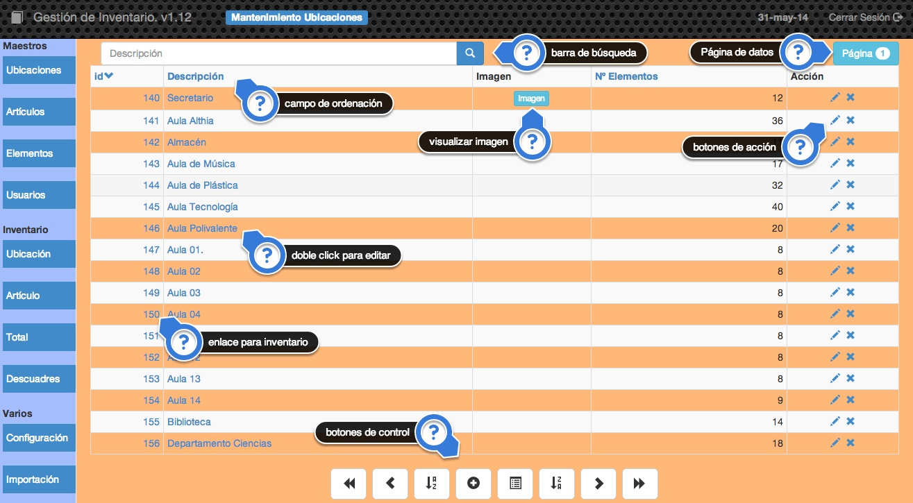

##2.1 Maestros
Dentro de maestros tenemos las opciones de acceder a la información almacenada en la base de datos, podremos añadir, cambiar, eliminar y consultar cualquier información referente a Ubicaciones, Artículos, Elementos y Usuarios de nuestra aplicación.

El funcionamiento de la pantalla inicial de cada una de los apartados de esta opción es muy similar

Podemos ver los siguientes puntos relevantes:

* __Barra de búsqueda:__ Podemos filtrar el contenido mostrado al teclear aquí una cadena de búsqueda. La búsqueda la hará solamente en el campo Descripción.
* __Página de datos:__ Muestra el número de página de datos que se está mostrando. La aplicación agrupa los registros de la tabla en página de un número determinado de registros. Este número se puede establecer en Configuración.
* __Campos de ordenación:__ En la cabecera de la tabla aparecerán enlaces en determinados nombres de campo, esto significa que se puede establecer el orden en el que se muestran los datos por ese campo. La flecha que aparece indica si el orden es ascendente o descendente.
* __Visualizar imagen:__ En las tablas en las que haya un campo de imagen se podra visualizar esta al pulsar en ese botón. Aparecerá un botón por cada registro al que se le haya asociado una imagen.
* __Botones de acción:__ Mediante estos botones podremos clonar, editar o eliminar un determinado registro de la tabla.
* __Enlace para inventario:__ Si pulsamos sobre el enlace que aparece sobre el campo <code>id</code> obtendremos un listado de inventario de ese registro.
* __Doble click para editar:__ Si pulsamos doble click sobre los campos que tienen un enlace podremos editarlos sin tener que entrar en la pantalla de edición de todo el registro, de esta forma se puede editar de una manera mucho más eficiente.
* __Botones de control:__ Mediante estos botones podremos controlar la manera en la que aparecen los datos y también añadir registros y obtener un listado de los registros mostrados:

| Botón | Descripción |
| -- | -- |
|  | Retrocede 4 páginas o va a la primera en caso de no poder retroceder tanto. |
|  | Retrocede una página. |
|  | Establece orden ascendente |
|  | Añade un nuevo registro a la tabla. |
|  | Genera un informe con los criterios de búsqueda y orden establecidos, es decir, genera un informe con los registros seleccionados. |
|  | Establece orden descendente |
|  | Avanza una página. |
|  | Avanza 4 páginas o se posiciona en la última en caso de no poder avanzar tanto. |
