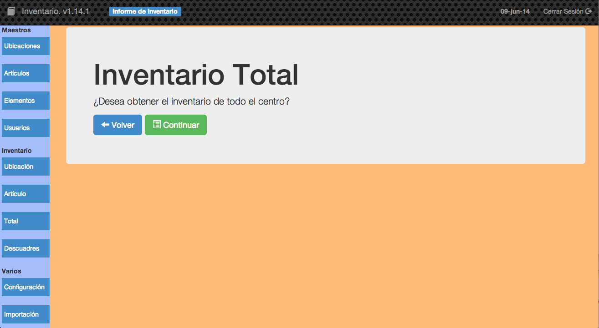

##2.2.3 Total

Esta opción nos permite obtener un listado de todo el inventario del centro, por pantalla ordenadas por ubicación.

El listado se generará en un archivo _PDF_ que se visualizará por pantalla y podrá ser impreso o almacenado en cualquier carpeta.
