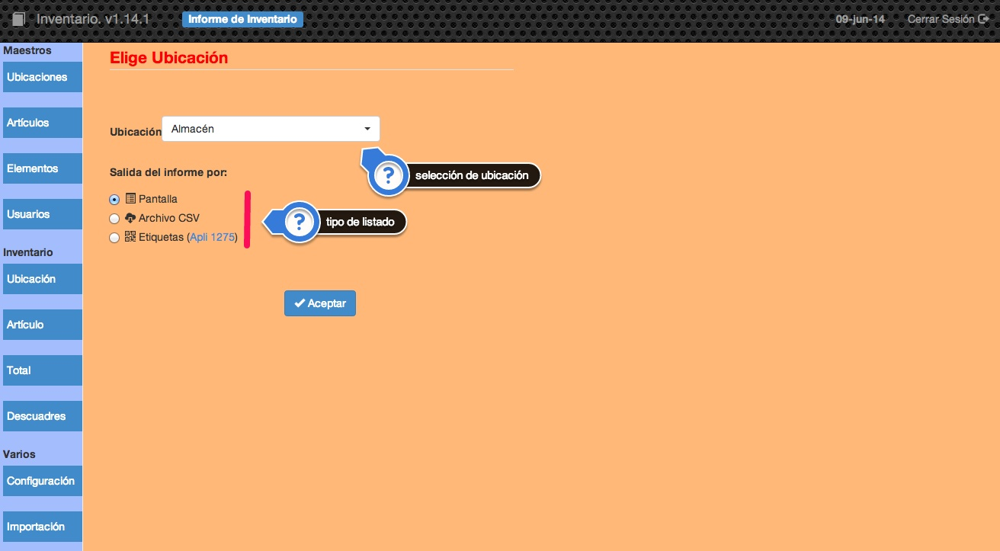
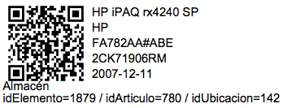

##2.2.1 Ubicación
Esta opción nos permitirá obtener todos los elementos que se encuentran asociados a una determinada ubicación.

En la pantalla podremos seleccionar la ubicacion de la cual queremos obtener un listado de elementos y también el tipo de listado que queremos obtener:

* __Pantalla.__ El listado se generará en un archivo _PDF_ que se visualizará por pantalla y podrá ser impreso o almacenado en cualquier carpeta.
* __Archivo CSV.__ Obtendremos un listado en un archivo _csv_ que podrá ser utilizado con cualquier hoja de cálculo (libreoffice, Microsoft Excel, google drive, etc.) para comprobar y actualizar el inventario de una determinada ubicación.
* __Etiquetas.__ Podemos obtener etiquetas correspondientes a cada uno de los artículos de una ubicación. Estas etiquetas se imprimen con el formato de [Apli 1275](http://www.apli.es/producto/ficha_producto.aspx?referencia=01275&stype=referencia&referenciaValue=01275&q=01275). En las etiquetas figura un código QR que permitirá si lo escaneamos, acceder directamente a la pantalla de edición de ese elemento en concreto. Puede ser muy útil para comprobar el inventario con un dispositivo móvil como un teléfono o una tableta.

