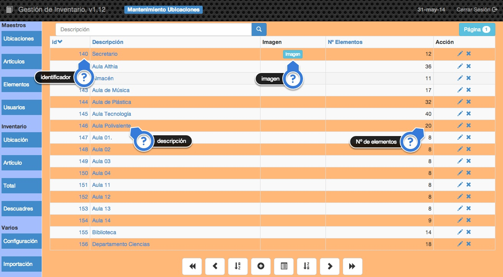

##2.1.1 Ubicaciones
Es una tabla muy sencilla en la que almacenaremos las diferentes ubicaciones del centro donde podamos tener cualquier elemento del inventario.

También puede ser cualquier persona/centro al que hayamos prestado cualquier elemento del inventario.

Por ejemplo:

    Aula de Ciencias
    Aula de Idiomas
    etc.

Podremos almacenar también si queremos la imagen de la ubicación.

En la pantalla podemos ver los siguientes datos:

- **identificador:** Es el código único asignado de forma automática por la aplicación a cada registro que añadamos a la tabla. Como se puede ver, podemos establecer el orden de visualización con este campo pulsando sobre <code>id</code> en la cabecera de la tabla. Si pulsamos sobre el indicador de una ubicación obtendremos el listado de los elementos asociados a esa ubicación, es decir, obtendremos el inventario de esa ubicación.
- **Descripción:** Es la descripción de la ubicación. Para establecer el orden de visualización por este campo tendremos que pulsar sobre <code>Descripción</code> en la cabecera de la tabla. Si pulsamos doble click sobre la descripción de una ubicación cualquiera podremos editarla sin tener que entrar en la pantalla de edición.
- **Imagen:** Si la ubicación tiene asociada una imagen aparecerá el icono imagen y al pulsar sobre este icono se nos mostrará la imagen.
- **Nº de elementos:** Este es un campo que calcula la aplicación y nos muestra el número de registros de la tabla elementos que están asociados a esta ubicación. Un número 0 indicaría que todavía no hay ningún elemento asociado a esta ubicación.

Si pulsamos sobre el botón de editar alguna ubicación obtendremos una pantalla como esta:

En ella podremos cambiar la descripción de la ubicación además de poder asignarle una imagen. Si pulsamos sobre el botón de añadir una imagen depende de si estamos accediendo a la aplicación desde un ordenador o desde un dispositivo **móvil**, en el primer caso aparecerá el cuadro de diálogo de selección de archivo y en el segundo caso nos aparecerá la opción de seleccionar un archivo o de tomar una fotografía para añadirla.
