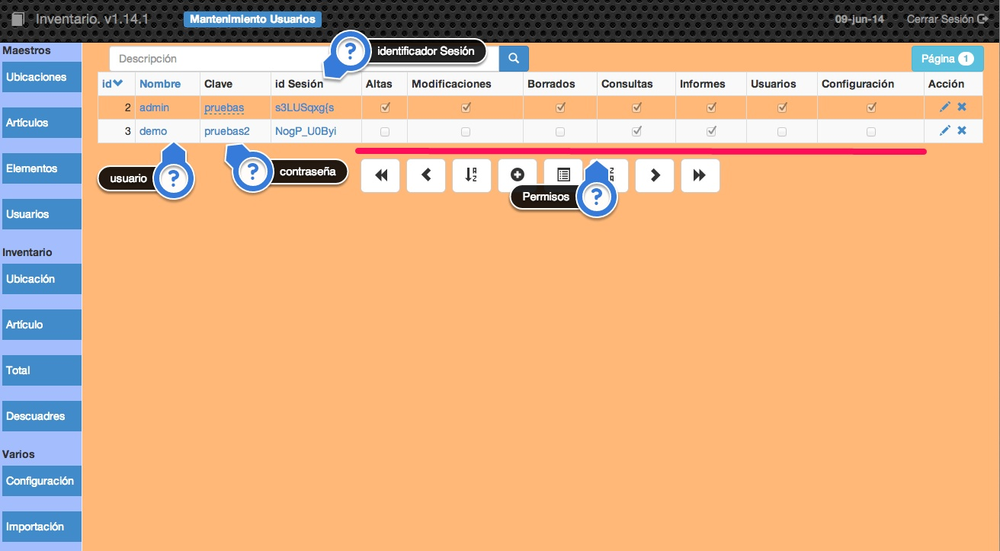

##2.1.4 Usuarios

Para poder utilizar la aplicación hay que identificarse con un <code>usuario</code> y una <code>contraseña</code>

En esta tabla se almacenarán los datos de los usuarios que pueden utilizar la aplicación.

Estos son los apartados más importantes que aparecen en la pantalla:

* __Usuario.__ Nombre del usuario para identificarse en la aplicación.
* __Clave.__ Contraseña que tiene asignada el usuario.
* __Identificador de sesión.__ Serie de caracteres que utiliza la aplicación para almacenar la información en el navegador sobre el acceso a la aplicación.
* __Permisos.__ Indica si el usuario tiene posibilidades de:
 * __Altas.__ Si el usuario podrá incluir nueva información en la aplicación.
 * __Modificaciones.__ Si el usuario podrá cambiar la información que tiene almacenada la aplicación.
 * __Borrados.__ Si se permiten eliminaciones de registros.
 * __Informes.__ Dará acceso a obtener todos los informes, listados y etiquetas de la aplicación.
 * __Usuarios.__ Si tendrá acceso a la gestión de  usuarios de la aplicación.
 * __Configuración.__ Si tiene permiso para poder cambiar la configuración de la aplicación.

