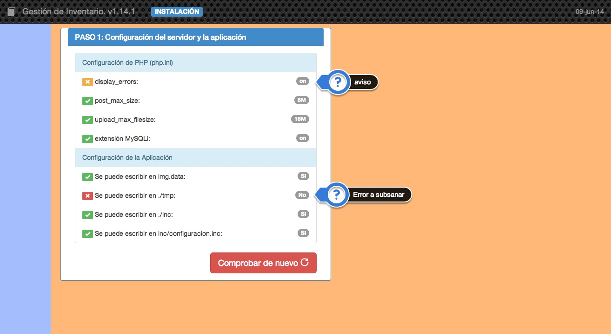
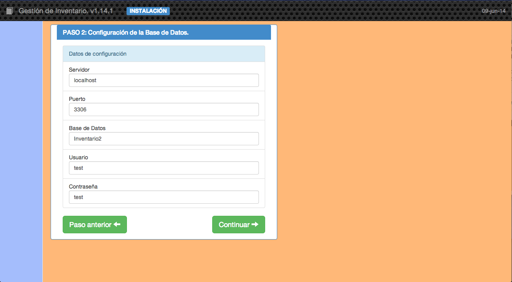
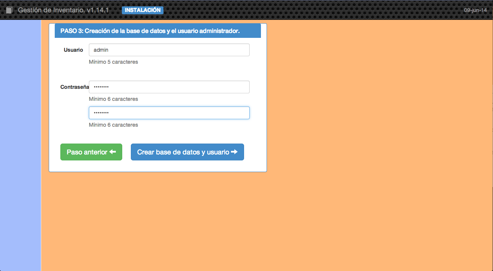
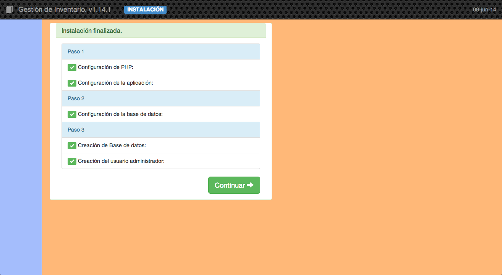

##1.1 Asistente de instalación

La primera vez que nos conectamos con la aplicación nos aparecerá el asistente de instalación que nos ayudará a terminar de configurar y poner en marcha nuestra aplicación de inventario.

    Para que el asistente pueda ejecutarse correctamente deberemos haber establecido los permisos correctos a los directorios temporal y de imágenes en el momento de la copia de los archivos. También es necesario que se haya creado una base de datos en MySQL y un usuario con contraseña con derecho de escritura sobre ella.

En la primera pantalla se realizan una serie de comprobaciones sobre el entorno de ejecución.

Si se detecta algún problema en la comprobación podrán aparecer dos tipos de mensajes:

* __Avisos.__ Vienen marcados en color naranja y no impiden continuar con la instalación.
* __Errores.__ Vienen marcados en rojo y hasta que no se solucionen no se podrá continuar.

Cuando tengamos superados los problemas pasaremos al <code>Paso 2</code> donde introduciremos los datos correspondientes al servidor MySQL y a la base de datos.

El usuario que pongamos tiene que tener el derecho para crear esa base de datos, es decir, tiene que tener los derechos suficientes para hacerlo. Se puede ver cómo hacerlo en el paso anterior.

Cuando tengamos los datos correctos podremos pasar al último paso, el <code>Paso 3</code>. En este paso se creará la base de datos elegida con lo que se borrará cualquier contenido que tenga y se creará en la aplicación un usuario con todos los derechos con los datos introducidos.

Al pulsar el botón de _Crear base de datos y usuario_ el programa de instalación completará todas las tareas y mostará la siguiente pantalla:

Con lo que quedará concluido el proceso de instalación y al pulsar continuar la aplicación nos mostrará la pantalla principal.
